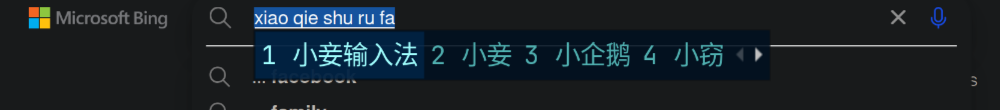
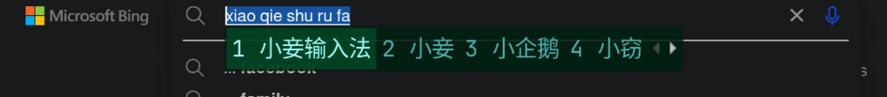
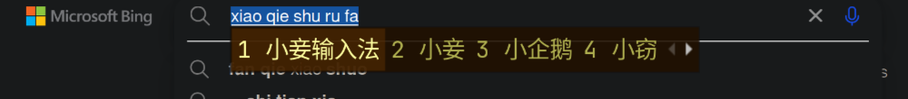
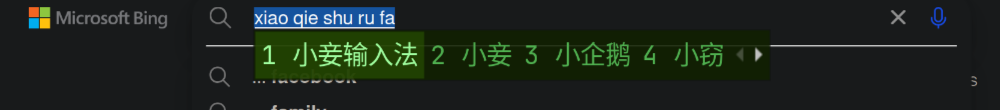
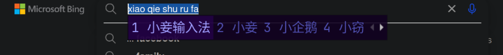
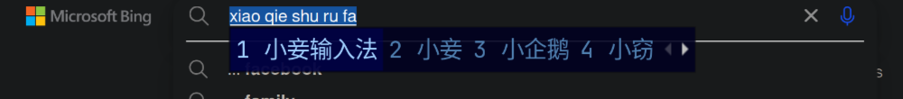

 ## Misty Colorful theme for fcitx.  

迷幻多彩主题。  

-- **misty**  
  
-- **misty-skyblue** & **misty-seagreen**  
  
  

-- **misty-orange** & **misty-lemon** & **misty-grape** & **misty-peach**  
  
  
  
  

-- **misty-carambola** & **misty-blueberry**  
  
  

----  

### 📦 Installation 安装  

The path of the actual config file should be modified according to your own `fcitx5`.  
The following config file path base on `Arch Linux`.  

实际的配置文件的路径应该根据你自己的 `fcitx5` 进行修改。  
以下的配置文件的路经基于`Arch Linux`。  

#### Install manually 手动安装  

Clone the repo to your fcitx5 config dir :  
```sh  
cd ~/.local/share/fcitx5/themes/  
git clone https://github.com/ovwxxwvo/misty.fcitx5.git  
```  

Link the theme dir :  
```sh  
cd ~/.local/share/fcitx5/themes/  
ln -sf  ./misty.fcitx/misty            ./  
ln -sf  ./misty.fcitx/misty-blueberry  ./  
ln -sf  ./misty.fcitx/misty-carambola  ./  
ln -sf  ./misty.fcitx/misty-grape      ./  
ln -sf  ./misty.fcitx/misty-lemon      ./  
ln -sf  ./misty.fcitx/misty-orange     ./  
ln -sf  ./misty.fcitx/misty-peach      ./  
ln -sf  ./misty.fcitx/misty-seagreen   ./  
ln -sf  ./misty.fcitx/misty-skyblue    ./  
```  

----  

### 🛠️ Configuration 配置  

Customize your configuration file.  
```sh  
vi ~/.local/share/fcitx5/conf/classicui.conf  
```  

~/.local/share/fcitx5/conf/classicui.conf  
```dosini  
Theme=misty  
DarkTheme=misty  

PreferTextIcon=True  
ShowLayoutNameInIcon=True  
UseInputMethodLanguageToDisplayText=True  

Font="Sans 12"  
MenuFont="Sans 12"  
TrayFont="Sans Bold 12"  

TrayTextColor=#d0ffa0  
TrayOutlineColor=#002020  
```  

----  

### 📚 Suggestion 建议  

Your app, Your rule. Feel free to modify the files.  
你的应用，你说了算。不要害怕修改文件。  

----  

### 📜 [MIT](LICENSE) License 许可证  


